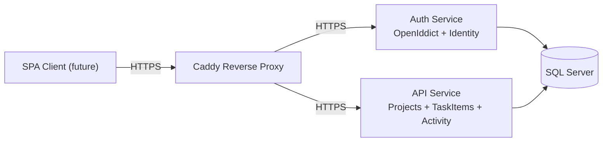

# Task Management Server

Backend for a Jira-style task management platform with project-based collaboration, role-based access control, and real-time activity updates.

The solution is split into two services:
- `TaskManagement.Auth`: OAuth2/OIDC with OpenIddict + ASP.NET Identity.
- `TaskManagement.Api`: Vertical-slice ASP.NET Core API for Projects, TaskItems, and Activity feed (including SignalR notifications).

Designed for local full-stack development with Docker + Caddy and structured to evolve toward production deployment patterns.

---

## Architecture



---

## Current Capabilities

### Authentication and Authorization
- OAuth2 / OpenID Connect via OpenIddict.
- JWT validation in API service.
- Role and resource-based authorization checks in handlers.
- Auth user directory exposes `isActive` status and user roles.
- Admin-only user management endpoints in Auth service:
  - `GET /api/users` with `search`, `isActive`, and `role` filters (paged).
  - `PATCH /api/users/{id}/status` to activate/deactivate users.
- Safety guards:
  - Admins cannot deactivate themselves.
  - The last active administrator cannot be deactivated.

### Project Management
- Create, update, delete, and read projects.
- Partial updates via `PATCH /api/projects/{id}`.
- Project membership tracking (`ProjectMember`) with audit fields.
- Project members listing endpoint with display names.
- Inactive users are surfaced in display names as `Name (Inactive)` when resolved from user directory.

### Task Management
- Create, update, delete, and read task items.
- Partial updates via `PATCH /api/taskitems/{id}`.
- Assignment support and project membership auto-add for newly assigned users.
- Filtered task queries for project, assignee, updater, status, unassigned, text search, date range, and pagination.

### Activity and Notifications
- Activity log for key events:
  - `ProjectCreated`
  - `ProjectRenamed`
  - `ProjectDeleted`
  - `TaskCreated`
  - `TaskStatusChanged`
  - `TaskRenamed`
  - `TaskDeleted`
  - `TaskAssigneeChanged`
  - `TaskDueDateChanged`
- Activity feed endpoint for dashboard consumption with pagination.
- Activity payload includes `oldValue/newValue` for rename/assignee/due-date changes and `oldStatus/newStatus` for status transitions.
- SignalR hub for real-time updates (`/hubs/activity`) with project and admin group subscriptions.

### Dashboard
- Aggregated dashboard summary endpoint: `GET /api/dashboard/summary`.

### SPA Real-Time Lifecycle (SignalR)
- Authentication for hub requests supports bearer tokens in `Authorization` header or `access_token` query string (WebSocket-friendly).
- Connections are closed on token expiration (`CloseOnAuthenticationExpiration = true`) so clients can reconnect with a fresh token.
- On each connection, the server auto-subscribes:
  - `Administrator` to global admin activity group.
  - Non-admin users to all projects they can access.
- Optional hub methods for explicit subscriptions:
  - `JoinProject(projectId)`
  - `JoinProjects(projectIds)`
  - `JoinAllProjects()`
  - `ResubscribeToScope()`
  - `LeaveProject(projectId)`

---

## Role Model

High-level role intent:
- `Administrator`: platform-wide superuser.
- `ProjectManager`: project delivery owner with project/task management in project scope.
- `User`: day-to-day contributor with task-focused access.

For endpoint-level details, see:
- [API Role Matrix](docs/ROLE_MATRIX.md)
- [API Filters and Patch Guide](docs/API_FILTERS_AND_PATCH.md)

---

## Architecture Style

Vertical slice architecture organizes by feature instead of technical layers.

Each feature typically contains:
- Commands and queries
- Handlers
- Validators
- Mappings
- Controller endpoints

Benefits:
- Better feature ownership
- Lower coupling between slices
- Cleaner incremental changes

---

## Tech Stack

- ASP.NET Core (.NET 8)
- EF Core (SQL Server)
- MediatR
- FluentValidation
- AutoMapper
- OpenIddict
- Serilog
- xUnit + integration testing
- Docker Compose + Caddy

---

## Services

### `TaskManagement.Auth`
- OpenIddict authorization server
- ASP.NET Identity user and role management
- Authorization Code + PKCE support
- Issues access and refresh tokens

### `TaskManagement.Api`
- Projects, TaskItems, Activity features
- Token validation and authorization enforcement
- SignalR real-time activity events
- Unit and integration tests

### `SQL Server`
- Shared persistence for Auth and API domains

### `Caddy`
- Local HTTPS termination
- Routing for `auth.localhost` and `api.localhost`

---

## Local Development

### Requirements
- Docker
- Docker Compose (v2)
- Hosts file entries:
  - `127.0.0.1 api.localhost`
  - `127.0.0.1 auth.localhost`

### Optional environment setup
You can copy `.env.example` to `.env` and adjust values if needed.

### Run
```bash
docker compose up --build
```

This starts SQL Server, Auth, API, and Caddy with local HTTPS routing.

---

## Testing

Run full solution tests:

```bash
dotnet test TaskManagementServer.sln -c Debug
```

Test coverage includes:
- Authorization and role behavior
- Command/query handler rules
- API integration flows
- Persistence and mappings

---

## Project Goal

This project is intended as a production-minded learning and portfolio codebase for a full-stack Jira-like platform.

Backend priorities:
- Correct authorization and tenancy boundaries
- Clean feature-oriented architecture
- Observable and testable behavior
- Real-time user-facing events for SPA dashboards
